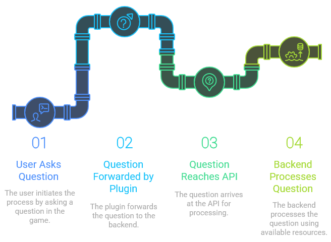

# Battista AI Backend

**Backend for Battista AI Helper Spigot Plugin**

Battista AI Backend powers the [Battista AI Helper](https://github.com/Manuel-Materazzo/battista-ai-spigot) Spigot plugin, enabling seamless, in-game AI-powered question answering for Minecraft servers. This backend uses advanced Large Language Models (LLMs) to provide players with instant, context-aware answers about custom game modes, server mechanics, and gameplay instructions.

---

## What is Battista AI Helper?

Battista AI Helper is a Minecraft Paper/Spigot plugin that lets players ask questions and receive instant AI-generated answers directly within the game chat. It is designed as a knowledgeable "AI helper" to guide players through the unique features and mechanics of your custom Minecraft server.

Players can:
- Ask questions about the server, game modes, or mechanics.
- Receive concise, accurate, and context-aware answers in real-time.
- Explore and understand custom content without ever leaving the game.

The backend (this project) hosts the AI models, manages documents and sources, and provides a REST API consumed by the plugin.

---

## Features

- **RAG-based Question Answering:** Uses Retrieval-Augmented Generation to answer questions based on your server's documentation and data.
- **Model Rotation & Retry:** Robust retry strategy with model fallback to ensure high availability (see `ModelRotateRetryStrategy`).
- **Document Indexing:** Easily index custom guides, rules, and FAQs for your server; answers are always grounded in your content.
- **REST API:** Exposes endpoints for the Spigot plugin and a built-in web UI for manual queries.
- **Caching & Persistence:** Fast responses and efficient resource usage via local caching.
- **Easy Deployment:** Dockerized for quick launch, with pre-configured UI and REST server.

---

## Architecture



---

## Getting Started

### Prerequisites

- Docker & Docker Compose
- Minecraft Paper/Spigot server with [Battista AI Helper plugin](https://github.com/Manuel-Materazzo/battista-ai-spigot)

### Setup

1. **Clone this repository:**

   ```sh
   git clone https://github.com/Manuel-Materazzo/battista-ai-backend.git
   cd battista-ai-backend
   ```

2. **Add your server documentation:**

   Put your server guides, rules, and content into the `data/` folder (supports PDFs, text files, etc).

3. **Configure environment:**

   Create a `.env` file:

   ```
   PATHWAY_PORT=8000
   ```

4. **Build and start the backend:**

   ```sh
   docker-compose up --build
   ```

   This will start:
   - The AI backend server (REST API for the plugin)
   - A web UI at [http://localhost:8501](http://localhost:8501) for manual questions/testing

5. **Configure the Spigot plugin:**

   In the Spigot plugin config, point the API endpoint to your backend server (e.g., `http://localhost:8000` or your server's IP).

---

## Usage

- **In Minecraft:** Players use `/ask <question>` (or other configured question vectors) to query the AI directly in-game.
- **Web UI:** Visit [http://localhost:8501](http://localhost:8501) to manually test queries and review source document status.

---

## Customization

- **LLM Model:** Change the `$llm_model` in `app.yaml` to use different models or endpoints.
- **Document Sources:** Add or update files in the `data/` directory.
- **Prompt Template:** Tweak the `$prompt_template` in `app.yaml` to adjust the AI's answer style.

---

## License

MIT

This project is for use with the Battista AI Helper plugin.

---

## Credits

- Built with [Pathway](https://pathway.com/) for scalable RAG pipelines.
- Streamlit UI template adapted from Pathway.

---

## Contributing

Pull requests and issues are welcome! Please open an issue for feature requests or bug reports.

---

**Battista AI Backend** — making Minecraft servers smarter, one answer at a time.